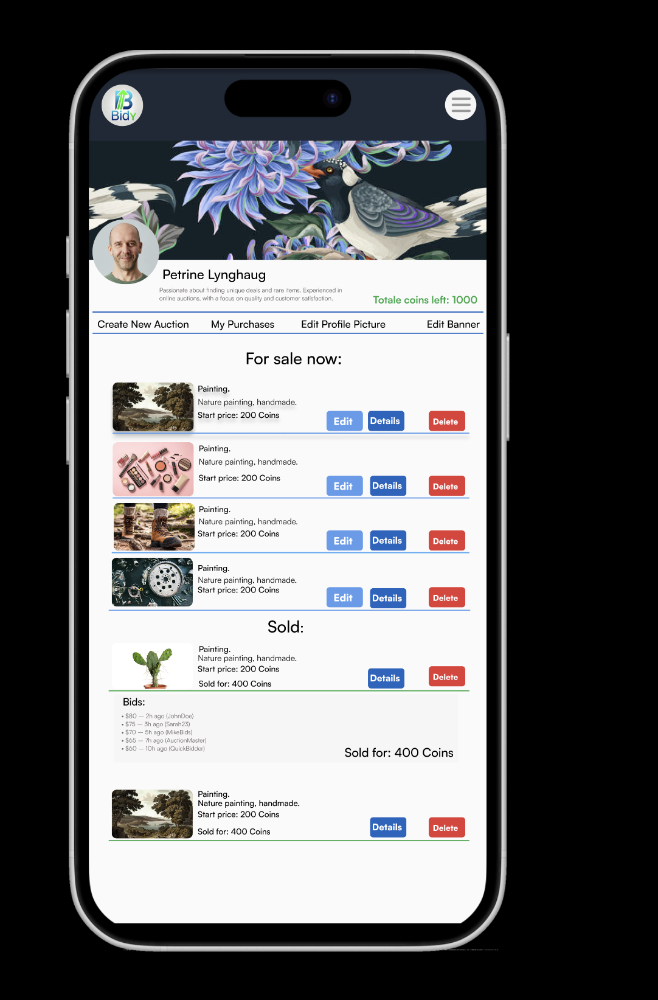

# Bidy-Semester-project
# How to Start the Project
To get started with this project, follow these steps:

1. **Install Dependencies:**  
Install the necessary dependencies with:

command:
```bash
npm install
```


2. **Run the Development Server:**
Start the development server with:

command:
```bash
npm start
```

3.	**Build for Production**
When you’re ready to deploy the project, build it for production:

command:
 ```bash
npm run build:css:prod
```
BIDY-SEMESTER-PROJECT/
├── .vscode/
├── auth/
│   ├── login/
│   └── register/
├── fonts/
│   ├── Satoshi-Black.woff
│   ├── Satoshi-Bold.woff
│   ├── Satoshi-Light.woff
│   └── Satoshi-Medium.woff
├── listing/
│   ├── index.html
│   └── node_modules/
├── node_modules/
├── profile/
│   └── index.html
├── src/
│   ├── input.css
│   ├── output.css
│   ├── css/
│   ├── js/
│   │   ├── api/
│   │   ├── components/
│   │   │   ├── authLinks.js
│   │   │   ├── createSingleCard.js
│   │   │   ├── footer.components.js
│   │   │   ├── listingCard.components.js
│   │   │   ├── myAuctions.component.js
│   │   │   ├── newauction-modal.component.js
│   │   │   ├── purchasedAuc.modal.component.js
│   │   │   ├── search-modal.component.js
│   │   │   ├── showCustomAlert.components.js
│   │   │   └── updateProfile-modal.component.js
│   │   ├── utilities/
│   │   │   ├── carouseCardUtils.js
│   │   │   ├── createInput.utilities.js
│   │   │   ├── formValidation.utilities.js
│   │   │   ├── header.utilities.js
│   │   │   └── storage.js
│   │   └── views/
│   ├── media/
│   └── mediaReadme/
├── .gitignore
├── favicon.ico
├── index.html
├── package-lock.json
├── package.json
├── README.md
└── tailwind.config.js


## Description
<details>
  <summary><strong>Click to read more</strong></summary>
  
  - **You can try this prototype by creating a user with an email address ending  @stud.noroff.no** 


- **User Stories**: 
 1. A user with a stud.noroff.no email can register
 2. A registered user can log in.
 3. A registered user can log out.
 4. A registered user can update their avatar.
 5. A registered user can view their total credit.
 6. A registered user can create a listing with a title, deadline date, media gallery, and description.
 7. A registered user can place a bid on another user’s listing.
 8. A registered user can view bids made on their listing.
 9. An unregistered user can search through listings.

- **Best Practices**:
 10.	Application JavaScript code adheres to best practices. 
 11.	Application CSS code follows best practices.
 12.	Application HTML code follows best practices.

- **User Experience**:
	13.	Errors are handled appropriately with helpful alerts to the user.
	14.	All form inputs are validated and accessible.
	15.	Navigation UI is efficient, functional, and accessible.

- **Design Appeal**: 
	16.	The theme is visually appealing to the target audience.
	17.	The theme’s color palette complies with WCAG standards.
	18.	Content is arranged in an appealing and responsive layout.
	19.	All submitted resources are delivered in the requested format.

</details>


## Development Choices and Reflection
<details>
  <summary><strong>Click to read more</strong></summary>

 **Browsersync Usage**

I opted not to use Live Server or set up path names manually. Instead, I chose Browsersync, which is used to run the project. Browsersync provides both a localhost environment and a shareable link that works on other devices connected to the same network. This made it easier for me to test functionality on mobile devices in real time.

**@tailwindcss/line-clamp**
 is a superior solution for multi-line text truncation because it leverages the native -webkit-line-clamp property for performance and simplicity. Unlike traditional CSS or JavaScript-based methods, it integrates seamlessly with Tailwind’s utility-first approach, enabling developers to add responsive and maintainable truncation directly in the HTML. It eliminates the need for custom code, ensures consistent behavior across browsers, and avoids the performance overhead of DOM manipulation, making it a time-efficient and reliable choice for modern web development.

**Validation and Error Handling**

I used Regex for user login validation and implemented a throw statement for error handling. This allowed me to capture and display error messages both from the API and my own custom validation. Additionally, I created a dedicated div where error codes are displayed, aligning with my design approach.

**Focus on Modal Implementation**

I placed significant emphasis on learning and implementing modals for this project. Modals were used for:
	•	Search functionality.
	•	Creating new posts.
	•	Viewing won auctions.
	•	Editing user profiles.

The dynamic modal for creating new auctions, along with the functionality to edit them, proved to be complex. Specifically, implementing a dynamic method for adding URLs presented challenges, but these issues have now been resolved.

The modal for creating a new auction follows a similar structure to the login and registration forms. It displays error messages at the bottom, indicating which fields need to be filled out.

**Design Approach**

I aimed to improve my design skills by focusing on a popping style, where icons and small elements “pop” visually to create a modern aesthetic. This style aligns with the Figma design file I created for this project.

**Search Functionality**

The search functionality is also implemented as a modal. It retrieves listings containing the searched keyword and includes pagination, which I implemented for the first time.

</details>

## Figma design





## Lighthouse 

